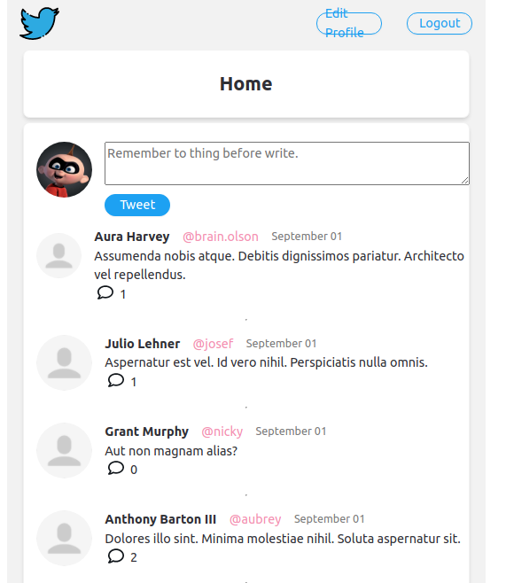

# Twitter Beta

This project is an App develop with Ruby on Rails, the project try to be like basic twitter.
You can add Twitt, and Comment any Twitt.


1. The data bases are in PostgreSQL.
2. Models are: User, Tweet, Comment
<br></br>

    * User:
        * id: integer
        * name: string
        * email: string
        * username: string
        * password: string
<br></br>

    * Tweet:
        * id: integer
        * user_id: bigint
        * body: text
        * comments_count: integer
<br></br>

    * Comment:
        * id: integer
        * body: text
        * user_id: bigint
        * tweet_id: bigint


## To Start

In this the project use Docker Container and Docker Compose to run the project.

1. Clone the repository in your computer.

2. Open the folder twitter-beta in a code editor.

3. Create an .env file and fill it with your GitHub credentials and add DB_HOST=twitter-beta_db_1.

```env
GIT_USER_NAME=Example-mail
GIT_USER_EMAIL=example@mail.com

DB_HOST=twitter-beta_db_1
```
4. In the terminal run (you have to located in the twitter-beta folder):
```bash
$ sudo docker-compose up
```

5. Open another terminal and run:
```bash
$ sudo docker-compose exec client bash
```
when you see something like this:


you are in good way.

6. Now you hahve to install the gems:
```bash
$ bundle install
```
then
```bash
$ bundle update
```

7. Now it is time to run the migrations
```bash
$ rails db:migrate
```

8. Finally, you can run the server:
```bash
$ rails s -b 0.0.0.0
```

## Finally

You can open your localhost in your browser and you can see the project.

http://localhost:3000


## To Stop

1. In the terminal use Ctrl + C to stop the server.

## Functionality

1. Login

To login you can use email: monito@test.com and password: 123456
<br/><br/>


<br/><br/>

2. Add a tweet


<br/><br/>

3. Comment a tweet


<br/><br/>

4. If you are owner of the tweet or comment you can delete and edit it.

<br/><br/>
### Ready, you can enjoy!

<br/><br/>

*Made by Monito Inc. 🙊*
